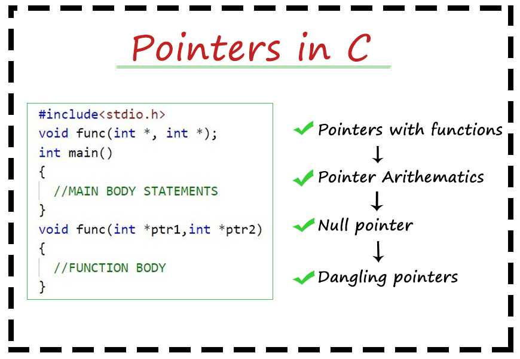

<div align="center">
<br>



</div>


<p align="center">


</p>


<h1 align="center"> C - Pointers, arrays and strings </h1>


<h3 align="center">
<a href="https://github.com/RazikaBengana/holbertonschool-low_level_programming/tree/main/pointers_arrays_strings#eye-about">About</a> •
<a href="https://github.com/RazikaBengana/holbertonschool-low_level_programming/tree/main/pointers_arrays_strings#hammer_and_wrench-tasks">Tasks</a> •
<a href="https://github.com/RazikaBengana/holbertonschool-low_level_programming/tree/main/pointers_arrays_strings#memo-learning-objectives">Learning Objectives</a> •
<a href="https://github.com/RazikaBengana/holbertonschool-low_level_programming/tree/main/pointers_arrays_strings#computer-requirements">Requirements</a> •
<a href="https://github.com/RazikaBengana/holbertonschool-low_level_programming/tree/main/pointers_arrays_strings#keyboard-more-info">More Info</a> •
<a href="https://github.com/RazikaBengana/holbertonschool-low_level_programming/tree/main/pointers_arrays_strings#mag_right-resources">Resources</a> •
<a href="https://github.com/RazikaBengana/holbertonschool-low_level_programming/tree/main/pointers_arrays_strings#bust_in_silhouette-authors">Authors</a> •
<a href="https://github.com/RazikaBengana/holbertonschool-low_level_programming/tree/main/pointers_arrays_strings#octocat-license">License</a>
</h3>

---

<!-- ------------------------------------------------------------------------------------------------- -->

<br>
<br>

## :eye: About

<br>

<div align="center">

**`C - pointers, arrays and strings`** theme introduces fundamental operations with pointers, arrays, and strings in C programming.
<br>
The programs implement basic functions like resetting pointers, swapping values, string manipulation (length, printing, reversing), and simple array operations, providing a foundation for working with these core C concepts.
<br>
<br>
This project has been created by **[Holberton School](https://www.holbertonschool.com/about-holberton)** to enable every student to understand how C language works.

</div>

<br>
<br>

<!-- ------------------------------------------------------------------------------------------------- -->

## :hammer_and_wrench: Tasks

<br>

**`0. 98 Battery st.`**

**`1. Don't swap horses in crossing a stream`**

**`2. This report, by its very length, defends itself against the risk of being read`**

**`3. I do not fear computers. I fear the lack of them`**

**`4. I can only go one way. I've not got a reverse gear`**

**`5. A good engineer thinks in reverse and asks himself about the stylistic consequences of the components and systems he proposes`**

**`6. Half the lies they tell about me aren't true`**

**`7. Winning is only half of it. Having fun is the other half`**

**`8. Arrays are not pointers`**

**`9. strcpy`**

**`10. Great leaders are willing to sacrifice the numbers to save the people. Poor leaders sacrifice the people to save the numbers`**

**`11. Don't hate the hacker, hate the code`**

<br>
<br>

<!-- ------------------------------------------------------------------------------------------------- -->

## :memo: Learning objectives

<br>

**_You are expected to be able to [explain to anyone](https://fs.blog/feynman-learning-technique/), without the help of Google:_**

<br>

```diff

General

+ What are pointers and how to use them

+ What are arrays and how to use them

+ What are the differences between pointers and arrays

+ How to use strings and how to manipulate them

+ Scope of variables

```

<br>
<br>

<!-- ------------------------------------------------------------------------------------------------- -->

## :computer: Requirements

<br>

```diff

General

+ Allowed editors: vi, vim, emacs

+ All your files will be compiled on Ubuntu 20.04 LTS using gcc, using the options -Wall -Werror -Wextra -pedantic -std=gnu89

+ All your files should end with a new line

+ A README.md file, at the root of the folder of the project is mandatory

+ Your code should use the Betty style. It will be checked using betty-style.pl and betty-doc.pl

- You are not allowed to use global variables

+ No more than 5 functions per file

- You are not allowed to use the standard library. Any use of functions like printf, puts, etc… is forbidden

+ You are allowed to use _putchar

- You don’t have to push _putchar.c, we will use our file. If you do it won’t be taken into account

+ In the following examples, the main.c files are shown as examples. <br> You can use them to test your functions, but you don’t have to push them to your repo (if you do we won’t take them into account). <br> We will use our own main.c files at compilation. <br> Our main.c files might be different from the one shown in the examples

+ The prototypes of all your functions and the prototype of the function _putchar should be included in your header file called main.h

+ Don’t forget to push your header file

```

<br>

**_Why all your files should end with a new line? See [HERE](https://unix.stackexchange.com/questions/18743/whats-the-point-in-adding-a-new-line-to-the-end-of-a-file/18789)_**

<br>
<br>

<!-- ------------------------------------------------------------------------------------------------- -->

## :keyboard: More Info

<br>

- You do not need to learn about **pointers to functions**, **pointers to pointers**, **multidimensional arrays**, **arrays of structures**, `malloc` and `free` yet.

<br>
<br>

<!-- ------------------------------------------------------------------------------------------------- -->

## :mag_right: Resources

<br>

**_Do you need some help?_**

<br>

**Concepts:**

* [Pointers and arrays](https://drive.google.com/file/d/10mzOFe6K9NYORcsgEZDzx30pIEVxcGAm/view?usp=sharing)

* [Data structures](https://drive.google.com/file/d/10sy4LqrZFWOyCGuRqsybGuFUn6zL3CCL/view?usp=sharing)

<br>

**Read or watch:**

* [C - Arrays](https://www.tutorialspoint.com/cprogramming/c_arrays.htm)

* [C - Pointers](https://www.tutorialspoint.com/cprogramming/c_pointers.htm)

* [C - Strings](https://www.tutorialspoint.com/cprogramming/c_strings.htm)

* [Memory Layout](https://aticleworld.com/memory-layout-of-c-program/)

<br>
<br>

<!-- ------------------------------------------------------------------------------------------------- -->

## :bust_in_silhouette: Authors

<br>

**${\color{blue}Razika \space Bengana}$**

<br>
<br>

<!-- ------------------------------------------------------------------------------------------------- -->

## :octocat: License

<br>

```C - pointers, arrays and strings``` _project has no license specified._

<br>
<br>

---

<p align="center"><br>2022</p>