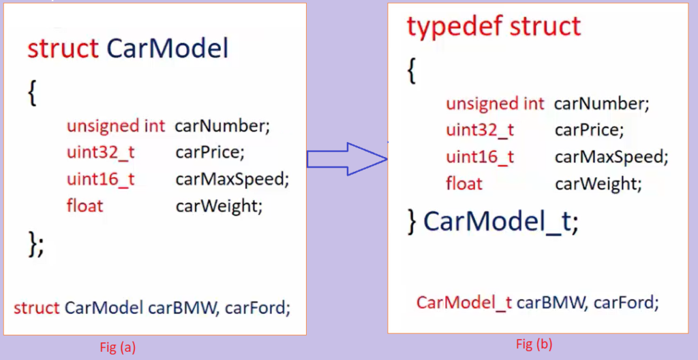

<div align="center">
<br>



</div>


<p align="center">


</p>


<h1 align="center"> C - Structures, typedef </h1>


<h3 align="center">
<a href="https://github.com/RazikaBengana/holbertonschool-low_level_programming/tree/main/structures_typedef#eye-about">About</a> •
<a href="https://github.com/RazikaBengana/holbertonschool-low_level_programming/tree/main/structures_typedef#hammer_and_wrench-tasks">Tasks</a> •
<a href="https://github.com/RazikaBengana/holbertonschool-low_level_programming/tree/main/structures_typedef#memo-learning-objectives">Learning Objectives</a> •
<a href="https://github.com/RazikaBengana/holbertonschool-low_level_programming/tree/main/structures_typedef#computer-requirements">Requirements</a> •
<a href="https://github.com/RazikaBengana/holbertonschool-low_level_programming/tree/main/structures_typedef#mag_right-resources">Resources</a> •
<a href="https://github.com/RazikaBengana/holbertonschool-low_level_programming/tree/main/structures_typedef#bust_in_silhouette-authors">Authors</a> •
<a href="https://github.com/RazikaBengana/holbertonschool-low_level_programming/tree/main/structures_typedef#octocat-license">License</a>
</h3>

---

<!-- ------------------------------------------------------------------------------------------------- -->

<br>
<br>

## :eye: About

<br>

<div align="center">

**`C - structures, typedef`** theme explores the creation and manipulation of custom data types in C.
<br>
The programs implement a structure representing a dog, along with functions to initialize, print, create, and free dog structures, demonstrating the practical use of `structures` and `typedef` in organizing and managing related data.
<br>
<br>
This project has been created by **[Holberton School](https://www.holbertonschool.com/about-holberton)** to enable every student to understand how C language works.

</div>

<br>
<br>

<!-- ------------------------------------------------------------------------------------------------- -->

## :hammer_and_wrench: Tasks

<br>

**`0. Poppy`**

**`1. A dog is the only thing on earth that loves you more than you love yourself`**

**`2. A dog will teach you unconditional love. If you can have that in your life, things won't be too bad`**

**`3. Outside of a dog, a book is a man's best friend. Inside of a dog it's too dark to read`**

**`4. A door is what a dog is perpetually on the wrong side of`**

**`5. How many legs does a dog have if you call his tail a leg? Four. Saying that a tail is a leg doesn't make it a leg`**

<br>
<br>

<!-- ------------------------------------------------------------------------------------------------- -->

## :memo: Learning objectives

<br>

**_You are expected to be able to [explain to anyone](https://fs.blog/feynman-learning-technique/), without the help of Google:_**

<br>

```diff

General

+ What are structures, when, why and how to use them

+ How to use typedef

```

<br>
<br>

<!-- ------------------------------------------------------------------------------------------------- -->

## :computer: Requirements

<br>

```diff

General

+ Allowed editors: vi, vim, emacs

+ All your files will be compiled on Ubuntu 20.04 LTS using gcc, using the options -Wall -Werror -Wextra -pedantic -std=gnu89

+ All your files should end with a new line

+ A README.md file, at the root of the folder of the project is mandatory

+ Your code should use the Betty style. It will be checked using betty-style.pl and betty-doc.pl

- You are not allowed to use global variables

+ No more than 5 functions per file

+ The only C standard library functions allowed are printf, malloc, free and exit

+ In the following examples, the main.c files are shown as examples. <br> You can use them to test your functions, but you don’t have to push them to your repo (if you do we won’t take them into account). <br> We will use our own main.c files at compilation. <br> Our main.c files might be different from the one shown in the examples

+ Don’t forget to push your header file

+ All your header files should be include guarded

```

<br>

**_Why all your files should end with a new line? See [HERE](https://unix.stackexchange.com/questions/18743/whats-the-point-in-adding-a-new-line-to-the-end-of-a-file/18789)_**

<br>
<br>

<!-- ------------------------------------------------------------------------------------------------- -->

## :mag_right: Resources

<br>

**_Do you need some help?_**

<br>

**Read or watch:**

* [0x0d. Structures.pdf](https://drive.google.com/file/d/143GRlFxNIEdq4MrN2utQLN1FgwvC_Eu9/view?usp=sharing)

* [struct (C programming language)](https://en.wikipedia.org/wiki/Struct_(C_programming_language))

* [Documentation: structures](https://github.com/hs-hq/Betty/wiki/Documentation:-Data-structures)

* [0x0d. Typedef and structures.pdf](https://drive.google.com/file/d/140Z8QBDS0x-lAPRSI2StLMkxpcoiMS7k/view?usp=sharing)

* [typedef](https://publications.gbdirect.co.uk//c_book/chapter8/typedef.html)

* **Programming in C** by Stephen Kochan - Chapter 8, Working with Structures p163-189

* [The Lost Art of C Structure Packing](http://www.catb.org/esr/structure-packing/)

<br>
<br>

<!-- ------------------------------------------------------------------------------------------------- -->

## :bust_in_silhouette: Authors

<br>

**${\color{blue}Razika \space Bengana}$**

<br>
<br>

<!-- ------------------------------------------------------------------------------------------------- -->

## :octocat: License

<br>

```C - structures, typedef``` _project has no license specified._

<br>
<br>

---

<p align="center"><br>2022</p>