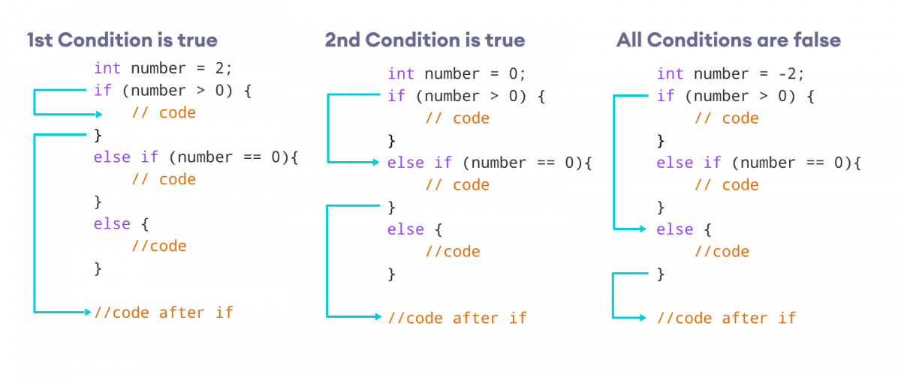

<div align="center">
<br>



</div>


<p align="center">


</p>


<h1 align="center"> C - Variables, if, else, while </h1>


<h3 align="center">
<a href="https://github.com/RazikaBengana/holbertonschool-low_level_programming/tree/main/variables_if_else_while#eye-about">About</a> •
<a href="https://github.com/RazikaBengana/holbertonschool-low_level_programming/tree/main/variables_if_else_while#hammer_and_wrench-tasks">Tasks</a> •
<a href="https://github.com/RazikaBengana/holbertonschool-low_level_programming/tree/main/variables_if_else_while#memo-learning-objectives">Learning Objectives</a> •
<a href="https://github.com/RazikaBengana/holbertonschool-low_level_programming/tree/main/variables_if_else_while#computer-requirements">Requirements</a> •
<a href="https://github.com/RazikaBengana/holbertonschool-low_level_programming/tree/main/variables_if_else_while#mag_right-resources">Resources</a> •
<a href="https://github.com/RazikaBengana/holbertonschool-low_level_programming/tree/main/variables_if_else_while#bust_in_silhouette-authors">Authors</a> •
<a href="https://github.com/RazikaBengana/holbertonschool-low_level_programming/tree/main/variables_if_else_while#octocat-license">License</a>
</h3>

---

<!-- ------------------------------------------------------------------------------------------------- -->

<br>
<br>

## :eye: About

<br>

<div align="center">

**`C - variables, if, else, while`** theme focuses on fundamental programming concepts in C, including variable declaration and manipulation, conditional statements, and loop structures.
<br>
The programs illustrate these concepts by performing tasks like generating random numbers, printing alphabets, and creating number combinations.
<br>
<br>
This project has been created by **[Holberton School](https://www.holbertonschool.com/about-holberton)** to enable every student to understand how C language works.

</div>

<br>
<br>

<!-- ------------------------------------------------------------------------------------------------- -->

## :hammer_and_wrench: Tasks

<br>

**`0. Positive anything is better than negative nothing`**

**`1. The last digit`**

**`2. I sometimes suffer from insomnia. And when I can't fall asleep, I play what I call the alphabet game`**

**`3. alphABET`**

**`4. When I was having that alphabet soup, I never thought that it would pay off`**

**`5. Numbers`**

**`6. Numberz`**

**`7. Smile in the mirror`**

**`8. Hexadecimal`**

**`9. Patience, persistence and perspiration make an unbeatable combination for success`**

**`10. Inventing is a combination of brains and materials. The more brains you use, the less material you need`**

**`11. The success combination in business is: Do what you do better... and: do more of what you do...`**

**`12. Software is eating the World`**

<br>
<br>

<!-- ------------------------------------------------------------------------------------------------- -->

## :memo: Learning objectives

<br>

**_You are expected to be able to [explain to anyone](https://fs.blog/feynman-learning-technique/), without the help of Google:_**

<br>

```diff

General

+ What are the arithmetic operators and how to use them

+ What are the logical operators (sometimes called boolean operators) and how to use them

+ What the the relational operators and how to use them

+ What values are considered TRUE and FALSE in C

+ What are the boolean operators and how to use them

+ How to use the if, if ... else statements

+ How to use comments

+ How to declare variables of types char, int, unsigned int

+ How to assign values to variables

+ How to print the values of variables of type char, int, unsigned int with printf

+ How to use the while loop

+ How to use variables with the while loop

+ How to print variables using printf

+ What is the ASCII character set

+ What are the purpose of the gcc flags -m32 and -m64

```

<br>
<br>

<!-- ------------------------------------------------------------------------------------------------- -->

## :computer: Requirements

<br>

```diff

General

+ Allowed editors: vi, vim, emacs

+ All your files will be compiled on Ubuntu 20.04 LTS using gcc, using the options -Wall -Werror -Wextra -pedantic -std=gnu89

+ All your files should end with a new line

+ A README.md file, at the root of the folder of the project

+ There should be no errors and no warnings during compilation

- You are not allowed to use system

+ Your code should use the Betty style. It will be checked using betty-style.pl and betty-doc.pl

```

<br>

**_Why all your files should end with a new line? See [HERE](https://unix.stackexchange.com/questions/18743/whats-the-point-in-adding-a-new-line-to-the-end-of-a-file/18789)_**

<br>
<br>

<!-- ------------------------------------------------------------------------------------------------- -->

## :mag_right: Resources

<br>

**_Do you need some help?_**

<br>

**Read or watch:**

* [Everything you need to know to start with C.pdf](https://drive.google.com/file/d/13B38ywvk-ba85HVpxvjqmL8829_-e3Ig/view?usp=sharing)

* [Keywords and identifiers](https://publications.gbdirect.co.uk//c_book/chapter2/keywords_and_identifiers.html)

* [integers](https://publications.gbdirect.co.uk//c_book/chapter2/integral_types.html)

* [Arithmetic Operators in C](https://www.tutorialspoint.com/cprogramming/c_arithmetic_operators.htm)

* [If statements in C](https://www.cprogramming.com/tutorial/c/lesson2.html)

* [if…else statement](https://www.tutorialspoint.com/cprogramming/if_else_statement_in_c.htm)

* [Relational operators](https://www.tutorialspoint.com/cprogramming/c_relational_operators.htm)

* [Logical operators](https://www.fresh2refresh.com/c-programming/c-operators-expressions/c-logical-operators/)

* [while loop in C](https://www.tutorialspoint.com/cprogramming/c_while_loop.htm)

* [While loop](https://www.youtube.com/watch?v=Ju1LYO9pkaI)

<br>

**`man` or `help`:**

* `ascii` <br> (You do not need to learn about `scanf`, `getc`, `getchar`, `EOF`, `EXIT_SUCCESS`, `time`, `rand`, `srand`, `RAND_MAX`, `for` loops, `do...while` loops, functions)

<br>
<br>

<!-- ------------------------------------------------------------------------------------------------- -->

## :bust_in_silhouette: Authors

<br>

**${\color{blue}Razika \space Bengana}$**

<br>
<br>

<!-- ------------------------------------------------------------------------------------------------- -->

## :octocat: License

<br>

```C - variables, if, else, while``` _project has no license specified._

<br>
<br>

---

<p align="center"><br>2022</p>